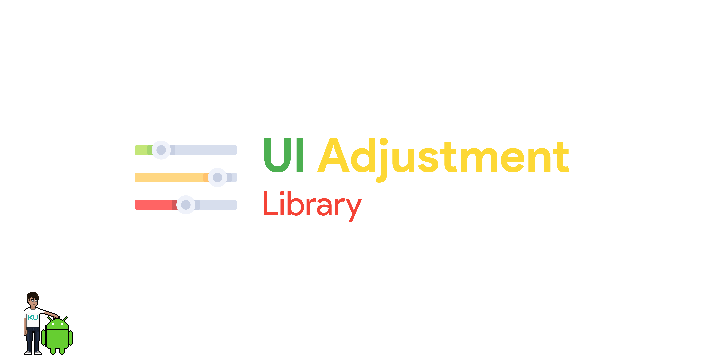
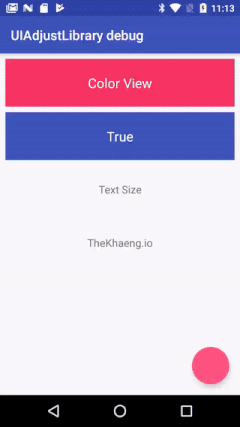
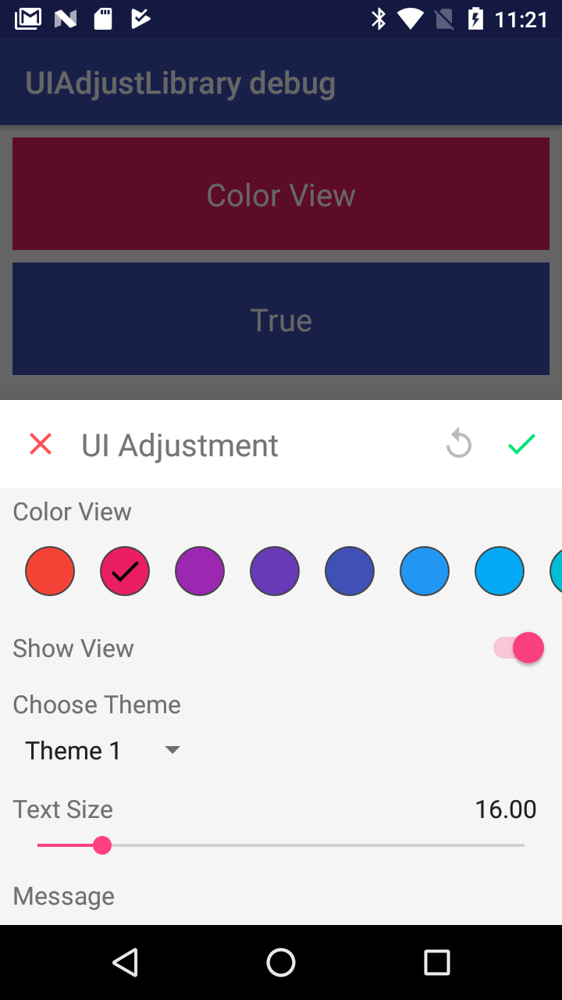
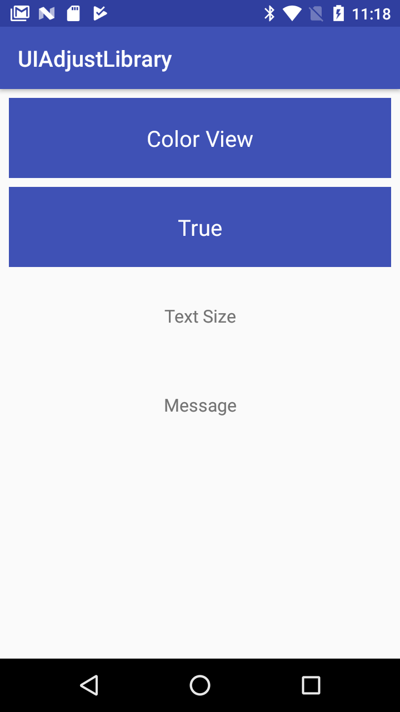

# **「 UI Adjustment Library 」**



[](https://travis-ci.org/TheKhaeng/material-design-guideline) [ ](https://bintray.com/nonthawit/TheKhaeng/ui-adjustment-core-library/_latestVersion) [ ](https://bintray.com/nonthawit/TheKhaeng/ui-adjustment-debug-library/_latestVersion) [ ](https://bintray.com/nonthawit/TheKhaeng/ui-adjustment-release-library/_latestVersion)


[README TH](./README_TH.md)

#### The UI Adjustment Library is a library that solves the problem of modifying the UI at runtime based on input data (without rebuilding or restarting). :)

#### This library also allows the project to mock result from API Service and mapped with the library to test UI's rendering in the various states. So you do not need to wait for API Services to be finhished to test your application.


> NOTE: Boolean, Color, Integer, Float, and String these are a value that you can modify in this project.





## 「 DEMO APPLICATION 」

```
clone repo and build it :)
```


## 「 Installation 」

Gradle

```gradle
compile 'com.github.thekhaeng:ui-adjustment-core-library:1.0.6'
debugCompile 'com.github.thekhaeng:ui-adjustment-debug-library:1.0.9'
releaseCompile 'com.github.thekhaeng:ui-adjustment-release-library:1.0.4'
compile 'com.google.code.gson:gson:2.8.2' //If not exist in your project
```

## 「 Debug VS Release 」
This library separates the build for **debug** and **release** mode, which does not increase the size of the application.

On the left picture, it is built with debug mode, and on the right with release mode (No UI adjustment).

 

## 「 How to setup our project to build separate debug and release. 」

In your project, you have to create folders are **debug** and **release** inside "src" folder, as below

```
── <YOUR PROJECT>
 │
 └─ src
     │
     ├─ debug: code used when you build "debug" mode
     │
     ├─ main: code always used
     │
     └─ release: code used when you build "release" mode
```

> **NOTE:** That's it !! you can split the code of debug and release already.


## 「 Usage 」

##### 1. Select activity/fragment that you need to use UI Adjustment.
##### 2. Create **debug** and **release** in src folder for split the code
##### 3. Create class at extends [UIActivityAdjustment.class](./app/src/debug/java/com/thekhaeng/library/uiadjustlibrary/UIAdjustMainActivity.java)/[UIFragmentAdjustment.class](./app/src/release/java/com/thekhaeng/library/uiadjustlibrary/UIAdjustMainActivity.java) both [debug](./app/src/debug/java/com/thekhaeng/library/uiadjustlibrary/) and [release](./app/src/release/java/com/thekhaeng/library/uiadjustlibrary/) (follow example link)
##### 4. Override createAdjustItemList() for build UI Adjustment bind with ID (as an example)
	
> **NOTE:** A class that you can used: **BooleanAdjustment.class, ColorAdjustment.class, IntegerAdjustment.class, RangeFloatAdjustment.class และ StringAdjustment.class**

```java
public class UIAdjustMainActivity extends UIActivityAdjustment<MainActivity>{

	...

    @NonNull
    @Override
    public List<BaseAdjustItem> createAdjustItemList(){
        List<BaseAdjustItem> itemList = new ArrayList<>();
        Map<String, AdjustColor> mapColor = new LinkedHashMap<>();
        mapColor.put( "1", new AdjustColor( "#F44336" ) );
        mapColor.put( "2", new AdjustColor( "#E91E63", true ) );
        mapColor.put( "3", new AdjustColor( "#9C27B0" ) );

        Map<String, AdjustInteger> mapInteger = new LinkedHashMap<>();
        mapInteger.put( "Theme 1", new AdjustInteger( MainActivity.THEME_1, true ) );
        mapInteger.put( "Theme 2", new AdjustInteger( MainActivity.THEME_2 ) );
        mapInteger.put( "Theme 3", new AdjustInteger( MainActivity.THEME_3 ) );

        Map<String, AdjustString> mapString = new LinkedHashMap<>();
        mapString.put( "Message 1", new AdjustString( getActivity().getString( R.string.message_1 ), true ) );
        mapString.put( "Message 2", new AdjustString( getActivity().getString( R.string.message_2 ) ) );
        mapString.put( "Message 3", new AdjustString( getActivity().getString( R.string.message_3 ) ) );


        itemList.add( ColorAdjustment.create( R.id.tv_color, "Color View", mapColor ) );
        itemList.add( BooleanAdjustment.create( R.id.tv_show, "Show View", true ) );
        itemList.add( IntegerAdjustment.create( THEME_ID, "Choose Theme", mapInteger ) );
        itemList.add( RangeFloatAdjustment.create( R.id.tv_size, "Text Size", new AdjustRangeFloat( 12, 42, 1, 16 ) ) );
        itemList.add( StringAdjustment.create( R.id.tv_message, "Message", mapString ) );
        return itemList;
    }
	...

}

```

##### 5. Listen adjust result, see example at [UIActivityAdjustment.class](./app/src/debug/java/com/thekhaeng/library/uiadjustlibrary/UIAdjustMainActivity.java)

```java
public class UIAdjustMainActivity extends UIActivityAdjustment<MainActivity>{
	
	...


    @Override
    protected void onColor( Activity activity, int id, @ColorInt int color ){
        super.onColor( activity, id, color );
        getActivity().findViewById( id ).setBackgroundColor( color );
        ...
    }

    @Override
    protected void onBoolean( Activity activity, int id, boolean value ){
        super.onBoolean( activity, id, value );
        if( id == R.id.tv_show ){
            AppCompatTextView tvShow = getActivity().findViewById( R.id.tv_show );
            if( value ){
                tvShow.setText( "True" );
                tvShow.setAlpha( 1.0f );
            }else{
                tvShow.setText( "False" );
                tvShow.setAlpha( 0.54f );
            }
        }
		 ...
    }

    @Override
    protected void onInteger( Activity activity, int id, int value ){
        super.onInteger( activity, id, value );
        if( THEME_ID == id ){
            getActivity().restart( value );
        }
        ...
    }

    @Override
    protected void onRangeFloat( Activity activity, int id, float value ){
        super.onRangeFloat( activity, id, value );
        if( id == R.id.tv_size ){
            ( (AppCompatTextView) getActivity().findViewById( R.id.tv_size ) )
                    .setTextSize(
                            TypedValue.COMPLEX_UNIT_SP,
                            value );
        }
        ...
    }

    @Override
    protected void onString( Activity activity, int id, String value ){
        super.onString( activity, id, value );
        if( id == R.id.tv_message ){
            ( (AppCompatTextView) getActivity().findViewById( R.id.tv_message ) ).setText( value );
        }
        ...
    }
    
}
```

##### 6. Bind a class created to activity/fragment.

```java
public class MainActivity extends AppCompatActivity{

    private View fab;

    @Override
    protected void onCreate( Bundle savedInstanceState ){
 		 ...

        fab = findViewById( R.id.fab_adjust );

        if( BuildConfig.DEBUG ){
            UIAdjustMainActivity
                    .create( this, fab )
                    .setDelayMillisTime( 500 )  // delay listener
                    .setUseLocalStorage( true, true );
        }

    }
	...
}
```

## 「 Full Option 」

```java
UIAdjustMainActivity
       .create( this, fab )
       .setTitle( "Example Title" )
       .setDelayMillisTime( 500 )
       .showKeepActivityGlobalSetting( textView )
       .setUseLocalStorage( true, true );

```
**`setTitle( title )`**

* string: **title**: change default title

**`create( activity/fragment, view )`**

* **activity/fragment**: 
* **view**: click to show UI Adjustment `NOTE: If you build a release mode, the view automatically hide.`


**`setDelayMillisTime( millis )`**
 
* to delay the listener after adjustment is finished.


**`showKeepActivityGlobalSetting( textView )`**
 
* TextView: **textView**: register text view to show "Don't keep activity" is enabled. (inside Developer mode setting.)


**`setUseLocalStorage( useLocalStorage, bindDataImmediately )`** 

* boolean: **useLocalStorage**: enable local storage (sharepreference) to store values when adjustment is complete.
* boolean: **bindDataImmediately**: set the data to the UI once the page is activated.


# Licence

Copyright 2017 TheKhaeng

Licensed under the Apache License, Version 2.0 (the "License"); you may not use this work except in compliance with the License. You may obtain a copy of the License in the LICENSE file, or at:

http://www.apache.org/licenses/LICENSE-2.0

Unless required by applicable law or agreed to in writing, software distributed under the License is distributed on an "AS IS" BASIS, WITHOUT WARRANTIES OR CONDITIONS OF ANY KIND, either express or implied. See the License for the specific language governing permissions and limitations under the License.


### Developed By Thai android developer.


<a href="https://www.facebook.com/nonthawit" target="_blank"></a> <a href="https://www.facebook.com/thekhaeng.io/" target="_blank"></a>


Follow [facebook.com/thekhaeng.io](https://www.facebook.com/thekhaeng.io) on Facebook page.
or [@nonthawit](https://medium.com/@nonthawit) at my Medium blog. :)

For contact, shoot me an email at nonthawit.thekhaeng@gmail.com

